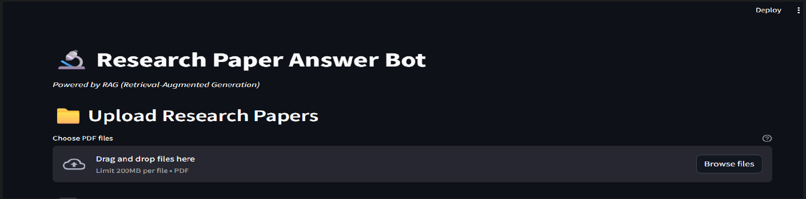
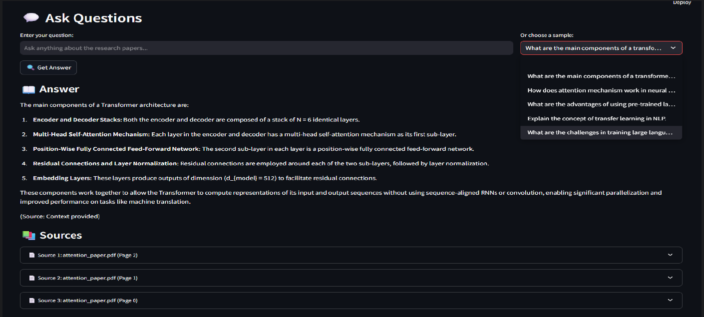
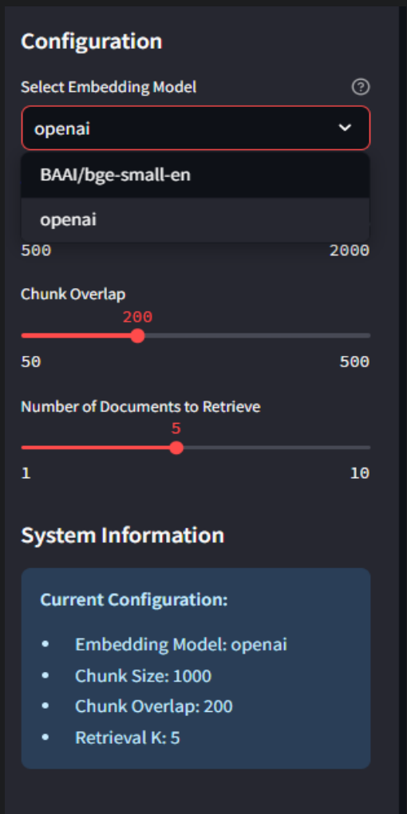

# Research Paper Answer Bot

## Project Overview

This project is a research paper question-answering bot built using Retrieval-Augmented Generation (RAG).

The idea behind the project was simple: instead of reading multiple long AI research papers manually every time I had a question, I wanted to build a small application where I could upload papers, process them, and ask questions in natural language.

The app reads PDF research papers, breaks them into smaller chunks, creates embeddings, stores them in a FAISS vector database, retrieves the most relevant chunks for a question, and then uses an LLM to generate an answer with source references.

I built this as part of my Analytics Vidya capstone project.

## Capstone Deck and Papers

I have included the capstone presentation and the research papers used in this project.

| File | Link |
| --- | --- |
| Capstone Presentation | [Capstone.pdf](Analytics%20Vidya%20Capstone/Capstone.pdf) |
| Attention Is All You Need | [attention_paper.pdf](Analytics%20Vidya%20Capstone/attention_paper.pdf) |
| GPT-4 Technical Report | [gpt4.pdf](Analytics%20Vidya%20Capstone/gpt4.pdf) |
| InstructGPT Paper | [instructgpt.pdf](Analytics%20Vidya%20Capstone/instructgpt.pdf) |
| Gemini Paper | [gemini_paper.pdf](Analytics%20Vidya%20Capstone/gemini_paper.pdf) |
| Mistral Paper | [mistral_paper.pdf](Analytics%20Vidya%20Capstone/mistral_paper.pdf) |

## UI Screenshots

### Upload Research Papers

The first step in the app is uploading one or more research papers in PDF format.



### Ask Questions and View Sources

After processing the documents, the user can ask questions and view answers along with the source documents used by the system.



### Configuration Panel

The sidebar lets the user select the embedding model and tune chunking and retrieval settings.



## What I Built

The project has a Streamlit interface and a RAG pipeline in the backend.

The main features are:

- Upload multiple PDF research papers
- Extract text from PDFs
- Split documents into smaller chunks
- Create embeddings using OpenAI or Hugging Face models
- Store document embeddings in FAISS
- Retrieve relevant document chunks for a user question
- Use an LLM to generate an answer
- Show source documents and page references
- Provide basic retrieval evaluation

## How the System Works

The workflow looks like this:

1. The user uploads PDF research papers.
2. The app loads the PDFs using LangChain document loaders.
3. The text is cleaned and split into chunks.
4. Each chunk is converted into an embedding.
5. The embeddings are stored in a FAISS vector database.
6. When the user asks a question, the app retrieves the most relevant chunks.
7. The retrieved context is passed to the LLM.
8. The LLM generates an answer and the app displays the sources.

## Technical Implementation

The main implementation is in `main.py`.

The project uses:

- Streamlit for the user interface
- LangChain for document loading, retrieval, and QA chain creation
- FAISS for vector storage and similarity search
- Azure OpenAI for GPT-based answer generation
- Azure OpenAI embeddings and Hugging Face embeddings for document representation
- PyPDFLoader for reading PDFs
- RecursiveCharacterTextSplitter for chunking long documents
- Contextual compression retriever for improving retrieved context

## RAG Pipeline

The core pipeline has four main parts:

| Step | What happens |
| --- | --- |
| Document processing | PDFs are loaded, cleaned, and split into chunks |
| Embedding generation | Text chunks are converted into vector embeddings |
| Retrieval | FAISS searches for chunks that are most relevant to the question |
| Response generation | The LLM uses the retrieved context to answer the question |

## Why I Used RAG

A normal chatbot can answer general questions, but it may not know the exact content of a specific research paper. RAG solves this by giving the model relevant context before it answers.

This makes the output more useful because the answer is grounded in the uploaded papers instead of only relying on the model's general training knowledge.

For research papers, this is especially helpful because users often want answers that are connected to a specific paper, section, or concept.

## Example Questions

The app includes sample questions such as:

- What are the main components of a transformer architecture?
- How does the attention mechanism work in neural networks?
- What are the advantages of using pre-trained language models?
- Explain the concept of transfer learning in NLP.
- What are the challenges in training large language models?

## What I Learned

This project helped me understand how a real RAG application is built end to end.

Some of my main learnings were:

- PDF documents need proper cleaning before they are useful for retrieval.
- Chunk size and chunk overlap have a big impact on answer quality.
- Embedding model choice matters because technical papers use dense language.
- FAISS is useful for fast similarity search over document chunks.
- Showing sources makes the app more trustworthy.
- A simple Streamlit UI can make an ML/NLP project much easier to use.
- RAG is not just about connecting a vector database to an LLM. The quality depends on document loading, chunking, retrieval, prompting, and evaluation.

## Challenges I Faced

One challenge was deciding how to split research papers. If the chunks are too small, the system may lose context. If they are too large, retrieval becomes less focused.

Another challenge was working with different embedding options. OpenAI embeddings and Hugging Face embeddings both work, but they can behave differently depending on the type of question and the technical depth of the paper.

I also wanted the answer to include sources, because without sources it is hard to trust a research paper QA system. Adding source previews made the output more useful.

## Possible Improvements

If I continue improving this project, I would like to:

- Add a cleaner chat history experience.
- Store processed vector indexes so papers do not need to be processed again every time.
- Add side-by-side PDF viewing with highlighted source chunks.
- Compare retrieval quality across different embedding models.
- Add better evaluation metrics such as recall@k and answer faithfulness.
- Add support for hybrid search using BM25 and vector retrieval together.
- Improve the UI design and make the app easier to deploy.
- Add Docker support for easier setup.

## How to Run

Install the required libraries first:

```bash
pip install streamlit langchain langchain-openai langchain-community faiss-cpu python-dotenv torch sentence-transformers pypdf
```

Create a `.env` file with the Azure OpenAI credentials required by your setup.

Then run:

```bash
streamlit run main.py
```

## Final Thoughts

This project was a good way for me to connect Generative AI concepts with an actual working application. It helped me understand how research papers can be turned into a searchable knowledge base and how an LLM can answer questions using retrieved context.

The most useful part of the project was seeing the full flow work together: upload papers, process them, ask a question, get an answer, and check the sources. That made RAG feel much more practical than just reading about it in theory.
